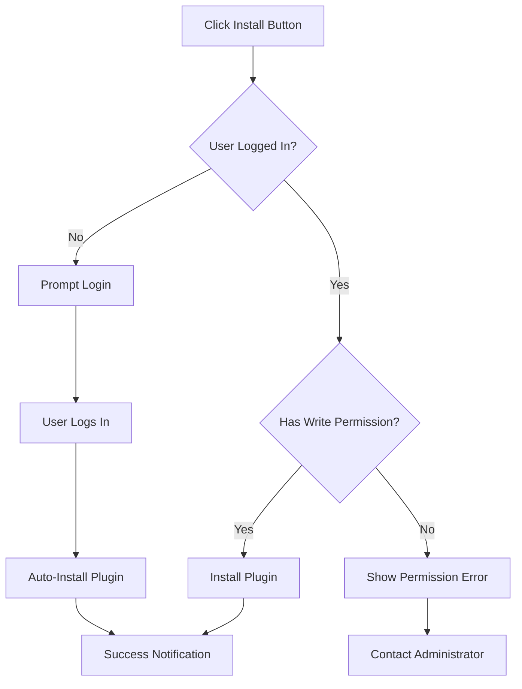

# KubeStellar Cluster Management Plugin

Real cluster onboarding and management plugin for KubeStellar with enhanced functionality.

## 🚀 Quick Install

[](http://localhost:5173/?install-plugin=https%3A//github.com/ansh7432/pluginv2)

*Click the button above to automatically install this plugin in your local KubeStellar UI*

> **🔐 Authentication Required:** You must be logged in to your KubeStellar UI with `write` permissions to install plugins. If you're not logged in, you'll be prompted to authenticate first.

### 📋 Manual Installation

If the automatic installation doesn't work:

1. **Log in** to your KubeStellar UI at `http://localhost:5173`
2. Navigate to **Plugin Management**
3. Click **"Install from Repository"**
4. Enter repository URL: `https://github.com/ansh7432/pluginv2`
5. Click **Install**

### 🔗 Alternative Install Links

Choose the port where your KubeStellar UI is running:

- **Port 5173** (Vite dev): [Install Plugin](http://localhost:5173/?install-plugin=https%3A//github.com/ansh7432/pluginv2)
- **Port 3000** (React dev): [Install Plugin](http://localhost:3000/?install-plugin=https%3A//github.com/ansh7432/pluginv2)
- **Port 8080** (Production): [Install Plugin](http://localhost:8080/?install-plugin=https%3A//github.com/ansh7432/pluginv2)

> **💡 Pro Tip:** If you click an install link while logged out, the plugin URL will be saved and the installation will proceed automatically after you log in.

## 🔐 Security & Permissions

### Authentication Requirements
- **Login Required:** All plugin installations require user authentication
- **Write Permissions:** Users must have `write` or `admin` permissions
- **Session Validation:** Tokens are validated on each request

### What Happens When You Click Install:

#### ✅ **If You're Logged In:**
1. 🚀 Redirects to Plugin Management page
2. 📦 Downloads and installs plugin automatically  
3. ✅ Shows success notification
4. 🔄 Refreshes plugin list

#### 🔐 **If You're Not Logged In:**
1. 💾 Saves plugin URL for later installation
2. 🔑 Prompts you to log in
3. ✅ Automatically installs plugin after successful login

#### 🚫 **If You Don't Have Permission:**
1. ❌ Shows "Insufficient permissions" error
2. 📞 Suggests contacting an administrator
3. 🛡️ Installation is blocked for security

## Features

- ✅ Real cluster onboarding
- 🔄 Enhanced CSR approval  
- 🏷️ Automatic labeling
- 🔍 Health verification
- 🗑️ Clean detachment
- 📊 Status tracking
- 🔐 **Secure installation with authentication**

## Installation Flow Diagram



## API Endpoints

The plugin installation uses these authenticated endpoints:

```bash
# Auto-install endpoint (requires authentication)
GET /api/plugins/auto-install?repo=https://github.com/ansh7432/pluginv2
Authorization: Bearer <jwt-token>

# Manual install endpoint  
POST /api/plugins/github/install
Authorization: Bearer <jwt-token>
Content-Type: application/json
{
  "repoUrl": "https://github.com/ansh7432/pluginv2",
  "autoUpdate": false
}
```

## Testing the Installation

### Test Authentication Protection:
```bash
# This should return 401 Unauthorized
curl "http://localhost:4000/api/plugins/auto-install?repo=https://github.com/ansh7432/pluginv2"

# This should work with valid token
curl "http://localhost:4000/api/plugins/auto-install?repo=https://github.com/ansh7432/pluginv2" \
  -H "Authorization: Bearer YOUR_JWT_TOKEN"
```

### Test Frontend Flow:
1. **Logged Out Test:** Open install link in incognito mode
2. **Logged In Test:** Open install link in normal browser
3. **Permission Test:** Try with read-only user account

## Troubleshooting

### Common Issues:

| Issue | Cause | Solution |
|-------|-------|----------|
| "Please log in to install plugins" | Not authenticated | Log in to KubeStellar UI first |
| "Insufficient permissions" | User lacks write permission | Contact admin to upgrade permissions |
| "Session expired" | JWT token expired | Log out and log back in |
| "Failed to connect" | Backend not running | Start KubeStellar backend server |

### Getting Help:
- 📖 Check the [KubeStellar Documentation](https://kubestellar.io/docs)
- 🐛 Report issues on [GitHub Issues](https://github.com/ansh7432/pluginv2/issues)
- 💬 Join our [Community Slack](https://kubernetes.slack.com/channels/kubestellar)

---

**🔒 Secure by Design:** This plugin installation system requires proper authentication and authorization to ensure your KubeStellar environment remains secure.
